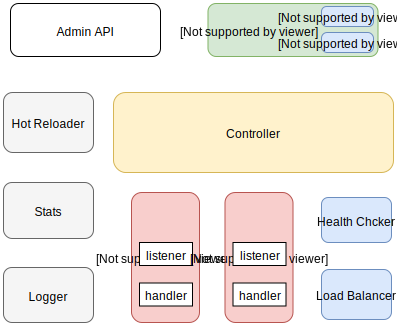
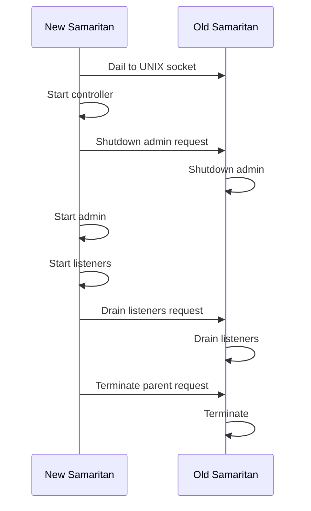

# Overview



## Admin API

An HTTP service for viewing Samaritan's runtime information, include config, stats.

[Admin API Reference](./admin-api.md)


## Config

Store service configuration, process services and configuration updates, and notify the Controller.

- Static
    
    Read and parse service configuration from bootstrap file. Work only when init config.

- Dynamic

    The gRPC delivers service and service configuration information.


## Controller

Control proc creation, destruction, and runtime behavior.

## Proc

The smallest processing unit used to proxy a real service, different protocols can have their own implementation.

## Hot Reloader

Responsible for smooth upgrades to Samaritan without downtime, use [SO_REUSEPORT](https://lwn.net/Articles/542629/).

The new Samaritan instance use UNIX socket to communicate with the old samaritan instance.



## Workflow

```mermaid
sequenceDiagram
    participant cfg as Config
    participant ctl as Controller
    participant proc as Proc
    cfg ->> ctl: New service event
    ctl ->> +proc: Create new proc
    cfg ->> ctl: Endpoints add event
    ctl ->> proc: Call OnSvcHostAdd()
    cfg ->> ctl: Endpoints remove event
    ctl ->> proc: Call OnSvcHostRemove()
    cfg ->> ctl: Config update event
    ctl ->> proc: Call OnSvcConfigUpdate()
    cfg ->> ctl: Del service event
    ctl ->> -proc: Call Stop()
```
