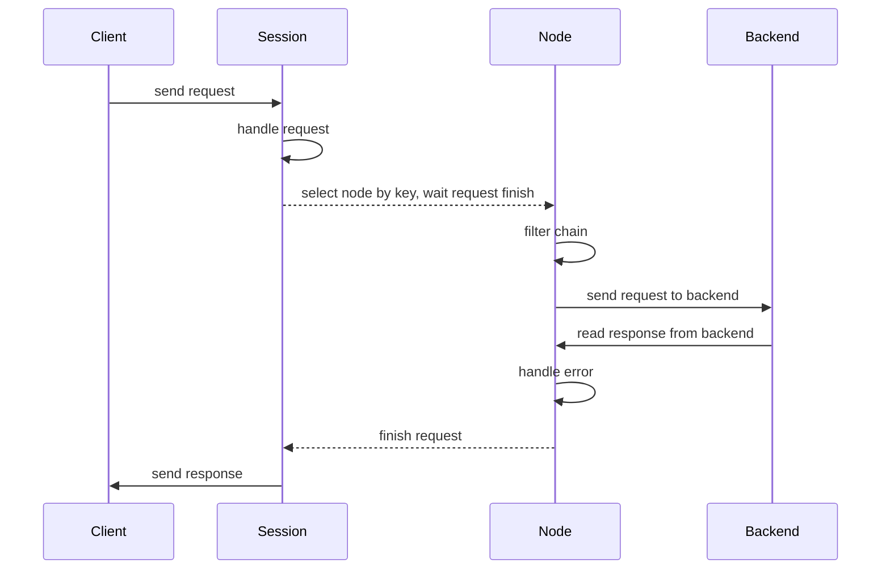
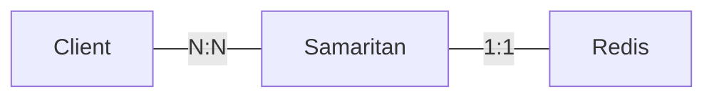

# Redis Cluster

Redis Processor in samaritan serves as a [Redis Cluster](https://redis.io/topics/cluster-spec) Proxy just as [corvus](https://github.com/eleme/corvus).

It adapts the Redis Cluster Protocol to the Single Redis Protocol. In Redis Cluster Protocol, a client should be able to react to `MOVED` and `ASK` response while in a single redis protocol clients know nothing about sharding.

```text
Single Redis Protocol client -> Redis Cluster Proxy -> Redis Cluster
```

## Redis Version

* Supporting Redis <= 4.x

## Modified commands

* `MGET`: split to multiple `GET`.
* `MSET`: split to multiple `SET`.
* `DEL`: split to multiple single key `DEL`.
* `EXISTS`: split to multiple single key `EXISTS`.
* `PING`: ignored and won't be forwarded.
* `INFO`, `TIME`: won't be forwarded to backend redis, information collected in proxy
   will be returned.
* `AUTH`: do authentication in proxy.
* `CONFIG`: support `get`, `set`, and `rewrite` sub-command to retrieve and manipulate corvus config.
* `SELECT`: ignored if index is `0`, won't be forwarded.

## Restricted commands

!!! warning
    The following commands require all argument keys to belong to the same redis node.

* `EVAL`: At least one key should be given.
* `SDIFF`, `SDIFFSTORE`, `SINTER`, `SINTERSTORE`, `SMOVE`, `SUNION`, `SUNIONSTORE`.
* `ZINTERSTORE`, `ZUNIONSTORE`.
* `PFCOUNTE`, `PFMERGE`.

## Unsupported commands

The following commands are not available, such as `KEYS`, we can't search keys across
all backend redis instances.

* `KEYS`, `MIGRATE`, `MOVE`, `OBJECT`, `RANDOMKEY`, `RENAME`, `RENAMENX`, `SCAN`, `WAIT`.
* `BITOP`, `MSETNX`
* `BLPOP`, `BRPOP`, `BRPOPLPUSH`.
* `PSUBSCRIBE`, `PUBLISH`, `PUBSUB`, `PUNSUBSCRIBE`, `SUBSCRIBE`, `UNSUBSCRIBE`.
* `EVALSHA`, `SCRIPT`.
* `DISCARD`, `EXEC`, `MULTI`, `UNWATCH`, `WATCH`.
* `CLUSTER`.
* `ECHO`, `QUIT`.
* `BGREWRITEAOF`, `BGSAVE`, `CLIENT`, `COMMAND`, `CONFIG`, `DBSIZE`, `DEBUG`, `FLUSHALL`,
   `FLUSHDB`, `LASTSAVE`, `MONITOR`, `ROLE`, `SAVE`, `SHUTDOWN`, `SLAVEOF`, `SYNC`.
* `SLOWLOG`

## Statistics

[statistics reference](/arch/stats/#statistics)

## Workflow



## Connection Model

Samaritan only open a connection to redis and uses the pipeline to communicate.



### Filter & FilterChain

Filter is used to extend the redis proc, which can modify or intercept requests.

```go
type Filter interface {
	Do(req *simpleRequest) FilterStatus
	Destroy()
}
```

Filter chain is used to store filter.
`Filter.Do` will be called by filter chain, if `FilterStatus` is `Stop`, 
the filter chain will stop and the subsequent filters will be ignored.
