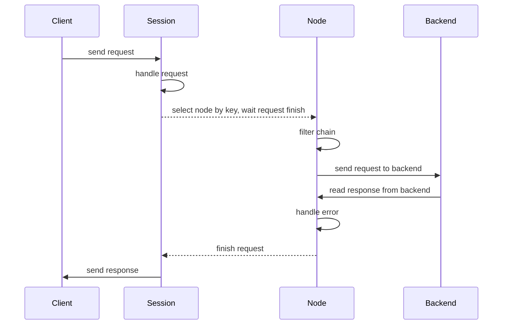

# Redis

Redis proc in samaritan serves as a [Redis Cluster] Proxy just as [corvus](https://github.com/eleme/corvus).

>Most redis client implementations don't support redis cluster. We have a lot of services relying on redis, which are written in Python, Java, Go, Nodejs etc.
>It's hard to provide redis client libraries for multiple languages without breaking compatibilities. We used twemproxy before, but it relies on sentinel
>for high availabity, it also requires restarting to add or remove backend redis instances, which causes service interruption.
>And twemproxy is single threaded, we have to deploy multiple twemproxy instances for large number of clients, which causes the ops headaches.

## Statistics

Provide detailed metrics about connection, request and per command, see [here](/arch/stats#redis)

## Workflow

The following figure illustrates the processing flow of a request.

!!! note
    1. Only opens one conection to the same node of redis cluster, and [use pipelining] to process commands.

## Requirements

- Redis <= 5.0

## Commands
### Modified

* `MGET`: split to multiple `GET`.
* `MSET`: split to multiple `SET`.
* `DEL`: split to multiple single key `DEL`.
* `EXISTS`: split to multiple single key `EXISTS`.
* `PING`: ignored and won't be forwarded.
* `INFO`, `TIME`: won't be forwarded to backend redis, information collected in proxy
   will be returned.
* `SELECT`: ignored if index is `0`, won't be forwarded.
* `SCAN`: scan one by one until all of them are scanned.

### Restricted

!!! warning
    The following commands require all argument keys to belong to the same redis node.

* `EVAL`: At least one key should be given.
* `SDIFF`, `SDIFFSTORE`, `SINTER`, `SINTERSTORE`, `SMOVE`, `SUNION`, `SUNIONSTORE`.
* `ZINTERSTORE`, `ZUNIONSTORE`.
* `PFCOUNTE`, `PFMERGE`.

### Unsupported

The following commands are not available, such as `KEYS`, we can't search keys across
all backend redis instances.

* `KEYS`, `MIGRATE`, `MOVE`, `OBJECT`, `RANDOMKEY`, `RENAME`, `RENAMENX`, `SCAN`, `WAIT`.
* `BITOP`, `MSETNX`
* `BLPOP`, `BRPOP`, `BRPOPLPUSH`.
* `PSUBSCRIBE`, `PUBLISH`, `PUBSUB`, `PUNSUBSCRIBE`, `SUBSCRIBE`, `UNSUBSCRIBE`.
* `EVALSHA`, `SCRIPT`.
* `DISCARD`, `EXEC`, `MULTI`, `UNWATCH`, `WATCH`.
* `CLUSTER`.
* `ECHO`.
* `BGREWRITEAOF`, `BGSAVE`, `CLIENT`, `COMMAND`, `CONFIG`, `DBSIZE`, `DEBUG`, `FLUSHALL`,
   `FLUSHDB`, `LASTSAVE`, `MONITOR`, `ROLE`, `SAVE`, `SHUTDOWN`, `SLAVEOF`, `SYNC`.
* `SLOWLOG`

[Redis Cluster]: https://redis.io/topics/cluster-spec
[use pipelining]: https://redis.io/topics/pipelining
