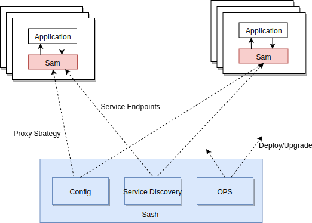

# Introduction

## What

**Samaritan (səˈmerətn)** is a client side proxy that works on L4 or L7 layer written by golang, provide high availability and load balancing.
You can call it **Sam (sam)** for simplicity.

## Why

At the beginning of our adapting to [SOA] (or [Microservices] if that make more sense to you), we used [HAProxy] as a client-side load balancer.
It does the job, painfully, as we have to do a file-based re-configuration whenever a change happens to the back-end nodes.

The maintenance of the configuration file really hurts our OPs a lot, not to mention that a reload to HAProxy causes downtime.
This issue is so popular that people created things like [Synapse] and [Bamboo] to manage HAProxy instances, even [hack deeply to minimize the downtime caused by HAProxy reload][HAProxyHack].
Those are great projects and actually get things done, however our approach to this is different, we want something more solid than templated configuration file with managed HAProxy processes.

Boldly we decide to write our own load balancer with SOA in mind to replace HAProxy, and that is **Samaritan**.
_We name this project Samaritan for saving our OPs from extreme misery:_

> A charitable or helpful person (with reference to Luke 10:33).
>
> "suddenly, miraculously, a Good Samaritan leaned over and handed the cashier a dollar bill on my behalf"

## Design goals

- Simple, modular, testable
- High performance with as little resources as possible
- Support hot upgrade, and the impact is as small as possible
- Keep the external interface is lightweight and backward compatible
- Be as transparent as possible and reduce business transformation

## Features

- **Sidecar**

    Sam is a separated process which runs alongside the application. All the requests to basic components such as *MySQL*, *Redis* and *MQ* from application will be proxied
    by the local instance. It shields the cluster discovery, switching, shrinking and other details in the distributed environment of the basic components, so that the application
    can use as smooth as a single machine.

- **Written by golang**

    [Go] is an open source programming language that makes it easy to build simple, reliable, and efficient software. It has good performance and is widely used in the cloud environment.

- **Hot re-configuration without downtime**

    Sam supports obtaining the proxy configuration and service endpoints from the remote and updating at runtime which means doesn't need to restart at all. It greatly reduces
    the cost of operation and maintenance, makes the large-scale deployment possible.

- **First-class Redis cluster support**

    [Redis Cluster] provides a way to run a Redis installation where data is automatically sharded across multiple Redis nodes. Sam supports L7 transparent proxy for redis requests, will forward
    the request to the correct node automatically. In addition, also supports transparent compression for big key and real-time hot key collection.

- **Good observability**

    Provide detailed metrics about connection and request which could help us understand the state of network and services, make decisions. These exported statistics could be viewable via [prometheus]
    or the local admin api.

## How it works

- Sam pulls proxy strategy and service endpoints from the management server and do the load balancing at client side.

- Sash is a management server. It delivers the change of proxy strategy and service endpoints to the related sam instances. Also, provides the ops tools, such as
  deploy, upgrade, etc.

    > Sash is a combination of Sam and Dashboard.

## Next step

I believe that by reading the above chapters, you should have a basic impression and concept of Sam, then you can try to [play with it](start.md).

[SOA]: https://en.wikipedia.org/wiki/Service-oriented_architecture
[Microservices]: https://en.wikipedia.org/wiki/Microservices
[HAProxy]: http://www.haproxy.org

[Bamboo]: https://github.com/QubitProducts/bamboo
[Synapse]: https://github.com/airbnb/synapse
[HAProxyHack]: http://engineeringblog.yelp.com/2015/04/true-zero-downtime-haproxy-reloads.html

[Go]: https://golang.org/
[Redis Cluster]: https://redis.io/topics/cluster-tutorial
[prometheus]: https://prometheus.io/
